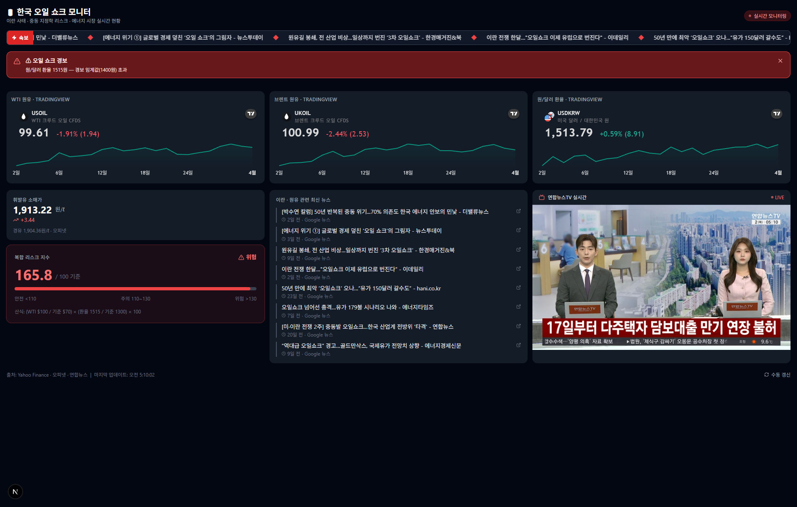

# 🛢 오일펄스 (OilPulse)

중동 지정학 리스크 · 유가 · 환율 · 에너지 시장 실시간 모니터링 대시보드



## 주요 기능

| 위젯 | 설명 | 데이터 소스 |
|---|---|---|
| **TradingView 차트** | WTI · 브렌트 원유 · 원/달러 환율 실시간 차트 | TradingView |
| **복합 리스크 지수** | 유가×환율 기반 리스크 게이지 (안전/주의/위험) | TradingView → Yahoo Finance 폴백 |
| **국내 유류가** | 휘발유 · 경유 · LPG 전국 평균가 | 오피넷 (한국석유공사) |
| **최저가 주유소** | 유종별 전국 최저가 주유소 | 오피넷 (한국석유공사) |
| **외환보유고** | 총 보유고 · 항목별 내역 · 전월 대비 변동 | 한국은행 ECOS |
| **뉴스 피드** | 에너지 · 유가 · 중동 관련 실시간 뉴스 | Google News RSS · 연합뉴스 RSS |
| **속보 티커** | 상단 자동 스크롤 속보 | Google News RSS · 연합뉴스 RSS |
| **연합뉴스TV** | 라이브 스트리밍 embed | 연합뉴스TV |

## 기술 스택

- **프레임워크**: Next.js 15 (App Router, React 19)
- **스타일**: Tailwind CSS 3
- **차트**: TradingView Embed Widget, Recharts
- **언어**: TypeScript 5
- **아이콘**: Lucide React

## 시작하기

### 1. 의존성 설치

```bash
npm install
```

### 2. 환경 변수 설정

```bash
cp .env.local.example .env.local
```

`.env.local` 파일을 열고 API 키를 입력합니다:

| 변수 | 설명 | 발급처 |
|---|---|---|
| `OPINET_API_KEY` | 한국석유공사 오피넷 API 키 | [공공데이터포털](https://www.data.go.kr/) (무료) |
| `BOK_API_KEY` | 한국은행 ECOS API 키 | [한국은행 ECOS](https://ecos.bok.or.kr/) (무료) |

> Yahoo Finance 및 TradingView Scanner API는 별도 키 없이 사용됩니다.

### 3. 개발 서버 실행

```bash
npm run dev
```

http://localhost:3000 에서 확인할 수 있습니다.

### 4. 프로덕션 빌드

```bash
npm run build
npm start
```

## 배포 (Vercel)

[](https://vercel.com/new)

1. GitHub 리포지토리 연결
2. 환경 변수 설정: `OPINET_API_KEY`, `BOK_API_KEY`
3. 자동 배포 완료

## 프로젝트 구조

```
src/
├── app/
│   ├── page.tsx              # 메인 페이지 (SSR 초기 데이터)
│   ├── layout.tsx            # 루트 레이아웃
│   └── api/                  # API 라우트
│       ├── oil-price/        # 유가 (Yahoo Finance)
│       ├── exchange-rate/    # 환율 (Yahoo Finance)
│       ├── tradingview-quote/# 시세 (TradingView Scanner)
│       ├── korea-fuel/       # 국내 유류가 (오피넷)
│       ├── cheapest-station/ # 최저가 주유소 (오피넷)
│       ├── forex-reserves/   # 외환보유고 (한국은행 ECOS)
│       └── news/             # 뉴스 (Google News · 연합뉴스)
├── components/
│   ├── DashboardClient.tsx   # 대시보드 클라이언트 (폴링/갱신)
│   ├── TradingViewChart.tsx  # TradingView 임베드 차트
│   ├── RiskIndexWidget.tsx   # 복합 리스크 지수 게이지
│   ├── DomesticFuelWidget.tsx# 국내 유류가
│   ├── CheapestStationWidget.tsx # 최저가 주유소
│   ├── ForexReservesWidget.tsx   # 외환보유고
│   ├── NewsFeed.tsx          # 뉴스 피드
│   ├── BreakingNewsTicker.tsx# 속보 티커
│   └── YonhapLiveWidget.tsx  # 연합뉴스TV
└── lib/
    ├── fetchData.ts          # 서버 사이드 데이터 fetcher
    └── types.ts              # 타입 정의
```

## 라이선스

MIT
